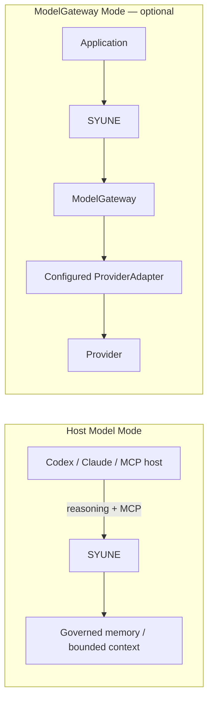

# SYUNE

> **The control layer between knowledge and AI agents.**

SYUNE is a governed memory, context and model-execution runtime for AI systems. It gives
agents persistent memory without giving them uncontrolled access to memory.

Traditional RAG primarily asks: **What information is relevant?** SYUNE also governs:

- Who may use it, and for what purpose?
- Which version is current, and what was valid at a requested time?
- Where did the information come from?
- Is it still active and retrievable?
- What bounded context actually reached the model?

## How it differs

SYUNE can use retrieval and RAG techniques; it adds governance before information becomes
model-visible.

```text
Traditional RAG                 SYUNE

Query                           Query
  ↓                               ↓
Retrieval                       Identity + Purpose
  ↓                               ↓
Top-K context                   Authorization
  ↓                               ↓
LLM                             Temporal / Version eligibility
                                  ↓
                                Hybrid Retrieval
                                  ↓
                                Lifecycle
                                  ↓
                                Provenance
                                  ↓
                                Bounded Context
                                  ↓
                                ModelGateway
                                  ↓
                                LLM
```

## Lean v1 architecture



See the [Lean v1 architecture](docs/architecture/LEAN_V1_ARCHITECTURE.md) for boundaries,
storage, detachability modes, and the default-disabled research surfaces.

## Connect SYUNE

SYUNE is model- and agent-framework independent. Connect it to Codex, Claude Code,
Claude Desktop, or another stdio MCP host through the canonical Lean MCP server, or
embed it in a custom Python application through the SDK. This is protocol-level
integration, not a claim that every agent framework has a native SYUNE adapter.

Using SYUNE for MCP memory and context does **not** inherently require a separate LLM
API credential. The host continues to reason with its own model access; SYUNE supplies
governed persistent memory and bounded context. ModelGateway is an optional second mode
for applications that explicitly configure provider execution.

Run syune setup and then syune doctor to prepare persistent state, save the exact installed MCP tuple, and validate a real handshake. Setup never edits third-party configuration.

Start with [MCP host integration](docs/integrations/MCP_HOSTS.md), the
[MCP contract](docs/MCP_V1.md), or the [Python SDK](docs/PYTHON_SDK.md).

## Why SYUNE

### Governed agent memory

An agent retrieves relevant memory without receiving records outside its authorized
identity or scope. Purpose and task context are carried through retrieval and audit.

### Version-aware knowledge

Applications distinguish `CURRENT`, `HISTORICAL`, and `AS_OF` information instead of
treating every stored record as simultaneously current.

### Traceable context

Model-visible context retains provenance and lineage so developers can determine where
the information came from and correlate it with durable audit events.

### Reliable model execution

ModelGateway centralizes structured output, retry, repair, fallback, budgets, provider
policy, health, evidence, and audit without coupling the memory layer to one provider.

## Quick start

Requires Python 3.12 or newer (below 4).

```console
pip install syune==1.1.0
python -m syune.quickstart --state-root ./.syune-demo
```

```python
from pathlib import Path
from syune import ContextRequest, ProvenanceMode, Syune

with Syune.open(state_root=Path(".syune-demo").resolve()) as memory:
    stored = memory.remember("The deployment window is Friday at 18:00 UTC.")
    context = memory.context(ContextRequest(
        "deployment window",
        purpose="release-planning",
        provenance_mode=ProvenanceMode.FULL,
    ))

    print(stored.data["memory_id"])
    print(context.data["rendered"])
    print(context.data["items"][0]["provenance"])
```

The [full quickstart](docs/QUICKSTART.md) covers revision, `CURRENT`, historical/`AS_OF`
queries, lifecycle, durable audit, shutdown, and restart. More focused programs are in
[`examples/`](examples/README.md).

Stable file Study supports individual TXT, Markdown, and text-based PDF sources through
the Python SDK. It does not recursively ingest folders or repositories. See the
[ingestion capability matrix](docs/INGESTION.md).

## Validated behavior

One frozen synthetic validation compared Strong RAG with Lean SYUNE on authorized useful
recall and context cleanliness:

| Metric | Strong RAG | Lean SYUNE |
|---|---:|---:|
| Authorized useful recall | 100% | 100% |
| Precision | 45.5% | 100% |
| Context precision | 45.5% | 100% |

SYUNE excluded 60 unauthorized records, one superseded record, one future-invalid record,
and six lifecycle-ineligible records. This is one controlled validation, not a universal
benchmark claim. SYUNE did **not** improve authorized useful recall over Strong RAG in
this dataset; it improved the cleanliness and governance of the resulting context.

Read the [Lean v1 validation](docs/benchmarks/LEAN_V1_VALIDATION.md) for methodology,
limitations, and canonical evidence links.

## Documentation

Start with the [documentation index](docs/README.md), [public API](docs/PUBLIC_API_V1.md),
[Python SDK](docs/PYTHON_SDK.md), [MCP interface](docs/MCP_V1.md),
[configuration](docs/CONFIGURATION.md), and [security policy](SECURITY.md).

## What v1 is not

SYUNE v1 is not an AGI, an autonomous truth engine, or an autonomous organizational-
learning system. Research cognition, learning, Council, Planner, and Executive code is
experimental, retained for compatibility, and disabled by default.

## Major limitations

- Deployment is single-node SQLite.
- The default vector backend is local-linear, not a production ANN service.
- High-contention multi-process writes are unsupported.
- Research cognition and learning are disabled by default.

See [known limitations](docs/known_limitations.md) for the complete list.

SYUNE 1.1.0 exposes Public API v1 and is licensed under the
[Apache License 2.0](LICENSE).
