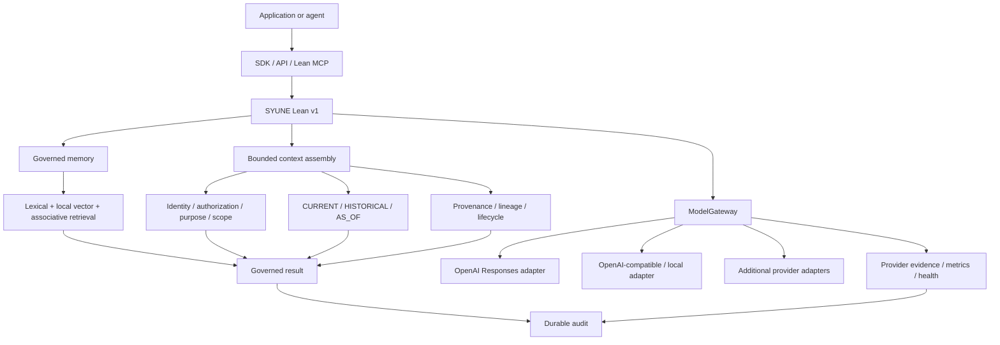

# Lean v1 architecture

SYUNE Lean v1 is a local, detachable control layer for governed memory, bounded context,
and reliable model execution. The application or agent retains task ownership and decides
what to do with the returned context or model result.

## Memory and retrieval

Memory is persisted in SQLite with typed identifiers and source records. Retrieval combines
lexical, local vector, entity, and associative signals. The default vector backend is
`local-linear`; it is deterministic and useful for local deployments but is not a
production ANN service.

## Governance before model visibility

Authorization filters candidates using the supplied user, agent, service, organization,
project, department, purpose, and task context. Temporal/version rules select current,
historical, or point-in-time records. Lifecycle rules exclude records that are archived,
forgotten, purged, superseded, future-invalid, or otherwise ineligible for the request.

Context assembly applies a character budget after retrieval and governance. Each returned
item can include provenance, lineage, temporal metadata, and a durable audit sequence.

## ModelGateway

ModelGateway is independent of memory storage. It provides provider routing, capability
checks, structured-output validation, retry, opt-in repair, explicit fallback, budgets,
circuit breaking, health, durable evidence, metrics, and idempotent logical calls.
Credentials remain provider-specific and are never embedded in the repository.

## Audit and observability

Lean operations write correlated audit events for memory, authorization, context,
lifecycle, and model calls. Gateway evidence stores sanitized request/response metadata;
secret-bearing fields are removed before persistence.

## Detachability

The supported assemblies are:

- `MEMORY_ONLY`
- `CONTEXT_ONLY`
- `MODEL_GATEWAY_ONLY`
- `MEMORY_CONTEXT`
- `FULL_LEAN`

Applications can select the smallest assembly they require. The default Lean runtime does
not initialize cognition, learning, Council, or Planner services.

## Stable and experimental boundaries

The stable v1 boundary is documented in the [public API](../PUBLIC_API_V1.md),
[Python SDK](../PYTHON_SDK.md), and [MCP interface](../MCP_V1.md). Research cognition,
learning, Council, Planner, and Executive modules remain compatibility surfaces only and
are disabled by default.
